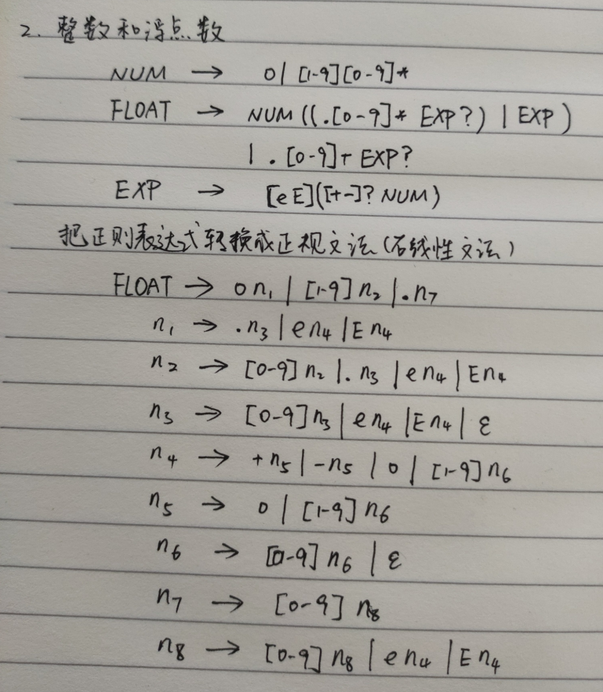
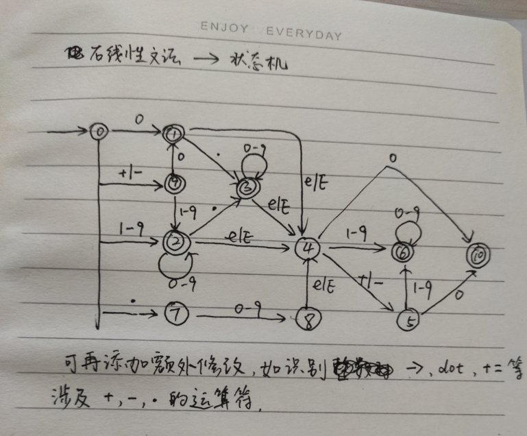
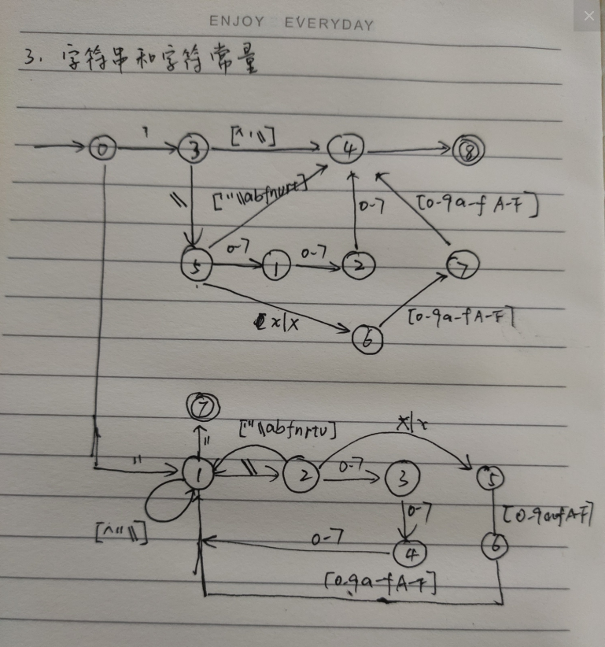
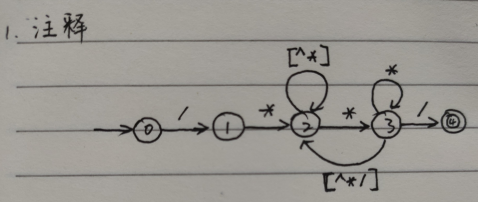

### 1 标识符

```
letter = [a-zA-Z]
digit = [0-9]
id = (letter|_)(letter|digit|_)*
```

#### 1.1 关键字处理

### 2 整常数（有符号）

#### 2.1 十进制

```
#NUM = 0|[1-9][0-9]*
[+-]?NUM
```

#### 2.2 八进制

```
[+-]?0[0-7]+
```

#### 2.2 十六进制

```
[+-]?0[xX][0-9a-fA-F]+
```

### 3 浮点数常数（单精度）

```
#EXP=[eE][+-]?NUM

NUM.[0-9]*(EXP)?
NUM EXP
.[0-9]+(EXP)?
```





### 4 字符串

```
\"([^"\] |
	\\['"\\abfnrtv] |
	\\[0-7][0-7][0-7] |
	\\[xX][0-9a-fA-F][0-9a-fA-F])*
\"
```

### 5 字符常量

```
\'([^'\] |
	\\['"\\abfnrtv] |
	\\[0-7][0-7][0-7] |
	\\[xX][0-9a-fA-F][0-9a-fA-F])
\'
```



### 6 运算符|分界符

```
//Operator
    DOT = 20,
    RIGHT_ARROW,

    SELF_PLUS,
    SELF_MINUS,

    PLUS,
    MINUS,
    MULT,
    DIV,
    MOD,

    AND,
    OR,
    NOT,

    BIT_AND, //get address
    BIT_OR,
    BIT_XOR,

    QUESTION, //?
    COLON, //:

    ASSIGN,
    OP_ASSIGN, //+=, -=, *=, /=

    COMMA,
        //relation operator
    REL_OP, //==, !=, >, <, >=, <=

    //Delimiter
    SEMICOLON = 70,
    OPEN_PARENTHESES,
    CLOSE_PARENTHESES,
    OPEN_BRACE,
    CLOSE_BRACE,
    OPEN_BRACKET,
    CLOSE_BRACKET,
```


### 7 注释处理

1）//

```
//.*\n
```

2）/*

使用状态机描述更加方便：




