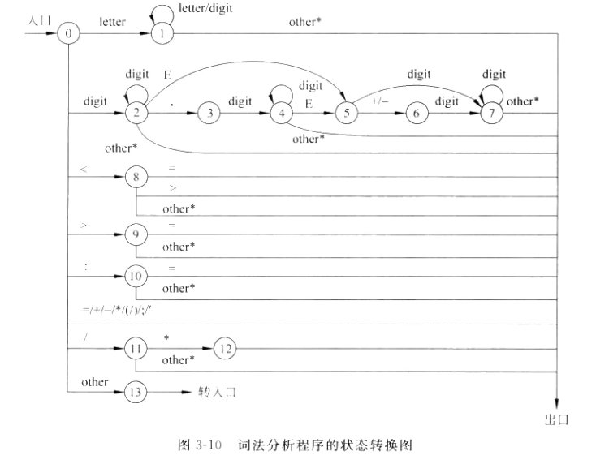

### 1 标识符

```
letter = [a-zA-Z]
digit = [0-9]
id = (letter|_)(letter|digit|_)*
```

#### 1.1 关键字处理

### 2 整常数

#### 2.1 十进制

```
#NUM = 0|[1-9][0-9]*
[+-]?NUM
```

#### 2.2 八进制

```
[+-]?0[0-7]+
```

#### 2.2 十六进制

```
[+-]?0[xX][0-9a-fA-F]+
```

### 3 浮点数常数

```
#EXP=[eE][+-]?NUM
NUM.NUM(EXP)?
NUM EXP
NUM. (EXP)?
.NUM (EXP)?
```

### 4 字符串


### 5 字符常量


### 6 运算符|分界符


### 7 注释处理


### 8 状态图



